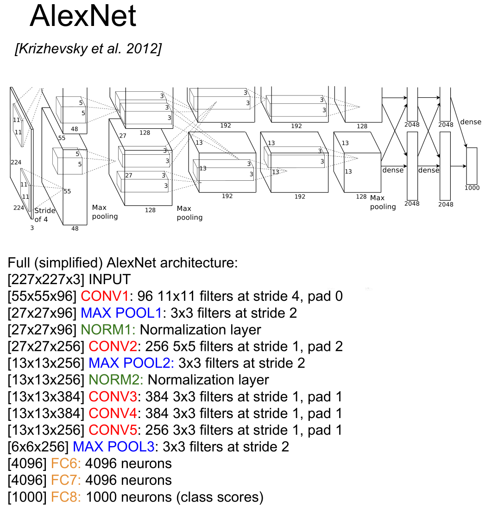

## LeNet
LeNet是一种典型的卷积神经网络的结构，由Yann LeCun发明。它的网路结构如下图：

代码实现参考下图结构：

LeNet-5网络是针对灰度图进行训练的，输入图像大小为`32*32*1`

## AlexNet

- **1.贡献**：ILSVRC2012冠军，展现出了深度CNN在图像任务上的惊人表现，掀起CNN研究的热潮，是如今深度学习和AI迅猛发展的重要原因。ImageNet比赛为一直研究神经网络的Hinton提供了施展平台，AlexNet就是由hinton和他的两位学生发表的，在AlexNet之前，深度学习已经沉寂了很久。
- **2.网络结构**：如下图所示，8层网络，参数大约有60 million，使用了relu函数，头两个全连接层使用了0.5的dropout。使用了LRN和重叠的池化，现在LRN都不用了，一般用BN作Normalization。当时使用了多GPU训练。
- **3.预处理**：先down-sample成最短边为256的图像，然后剪出中间的256x256图像，再减均值做归一化（over training set）。 **训练时，做数据增强**，对每张图像，随机提取出227x227以及水平镜像版本的图像。除了数据增强，还使用了PCA对RGB像素降维的方式来缓和过拟合问题。
- **4.预测**：对每张图像提取出5张（四个角落以及中间）以及水平镜像版本，总共10张，平均10个预测作为最终预测。
- **5.超参数**：SGD，学习率0.01，batch size是128，momentum为0.9，weight decay为0.0005（论文有个权重更新公式），每当validation error不再下降时，学习率除以10。权重初始化用（0，0.01）的高斯分布，二四五卷积层和全连接层的bias初始化为1（给relu提供正值利于加速前期训练），其余bias初始化为0。

- #### AlexNet Architecture

- #### AlexNet 每层的超参数及参数数量

## VGG16
 [VGGNet](https://arxiv.org/pdf/1409.1556.pdf)是由牛津大学计算机视觉组和Google DeepMind项目的研究员共同研发的卷积神经网络模型，包含VGG16和VGG19两种模型，其网络模型如图所示。

从网络模型可以看出，VGG16相比AlexNet类的模型具有较深的深度，通过反复堆叠`3*3`的卷积层和`2*2`的池化层，VGG16构建了较深层次的网络结构，整个网络的卷积核使用了一致的`3*3`的尺寸，最大池化层尺寸也一致为`2*2`。与AlexNet主要有以下不同：

- Vgg16有16层网络，AlexNet只有8层；
- 在训练和测试时使用了多尺度做数据增强。

### 1.感受野
对于给定的感受野，采用堆积的小卷积核优于采用大的卷积核,因为可以增加网络深度来保证学习更复杂的模式,而且代价还比较小(参数更少)。

VGG中，使用3个3x3卷积核来代替7x7卷积核,使用了2个3x3卷积核来代替5*5卷积核,这样做的主要目的是在保证具有相同感受野的条件下,提升了网络的深度,在一定程度上提升了神经网络的效果。

此外VGG使用相同大小的卷积核，还利于模块化设计，方便代码实现。

### 2.模型参数
VGG层之间高和宽减半、通道数翻倍的设计使得多数卷积层都有相同的模型参数尺寸和计算复杂度。由于每个卷积层的窗口大小一样，所以每层的模型参数尺寸和计算复杂度与输入高、输入宽。输入通道数和输出通道数的乘积成正比。

## NIN
全称[Network in network](https://arxiv.org/abs/1312.4400)，顾名思义，该网络的目的就是用某种方式堆叠小的网络。

左图展示了AlexNet和VGG的网络结构，右图展示了NiN的网络结构。

### 1.局部块

左图是AlexNet和VGG的网络结构局部,右图是NiN的网络结构局部

NiN块是NiN中的基础块。它由一个卷积层加两个充当全连接层的卷积层串联而成。其中第一个卷积层的超参数可以自行设置,而而第二和第三个卷积层的超参数一般是固定的。

如果要堆叠小模型，那么就无法避免全连接层，而将卷积结果的特征图转为全连接的维度转换，将耗费大量的资源。而使用1x1的卷积层正好可以完成这一替换。1x1的卷积层，可以看成全连接层，其中空间维度（高和宽）上的每个元素相当于样本，通道相当于特征。因此，NIN使用1x1卷积层来替代全连接层，从而使空间信息能够自然传递到后面的层。

### 2.替代FC，使用全局平均池化层求分类
NiN还有一个设计与AlexNet显著不不同:NiN去掉了了AlexNet最后的3个全连接层,取而代之地,NiN使用用了输出通道数等于标签类别数的NiN块,然后使用全局平均池化层对每个通道中所有元素求平均并直接用于分类。
这里的全局平均池化层即窗口形状等于输入空间维形状的平均池化层。
NiN的这个设计的好处是可以显著减小模型参数尺寸,从而缓解过拟合。然而,该设计有时会造成获得有效模型的训练时间的增加。

**NiN的以上设计思想影响了后面一系列卷积神经网络的设计。**

## GoogLeNet
[GoogleNet](https://static.googleusercontent.com/media/research.google.com/zh-CN//pubs/archive/43022.pdf)是2014年ImageNet图像识别挑战赛中的冠军。这里介绍的是其第一个版本。网络结构如下：

### 1.Inception块

Inception块结构

该块采用四条线路提取不同空间尺度下的信息，其中1x1卷计层用来减少输入通道数或调整输出通道数，以降低模型复杂度。4条线路都使用了合适的填充来使输入与输出的高和宽一致。

### 2.结构

### 3.总结
- Inception块相当于一个有4条线路的子网络。它通过不同窗口形状的卷积层和最大池化层来并行抽取信息,并使用1x1卷积层减少通道数从而而降低模型复杂度。
- GoogLeNet将多个设计精细的Inception块和其他层串联起来。其中Inception块的通道数分配之比是在ImageNet数据集上通过大量的实验得来的。
- GoogLeNet和它的后继者们一度是ImageNet上最高效的模型之一:在类似的测试精度下,它们的计算复杂度往往更低。

## ResNet
[ResNet](https://arxiv.org/pdf/1512.03385.pdf)有效的解决了深度卷积神经网络难训练的问题。梯度可以认为是信息量，当模型能够完全抽取数据的特征时，梯度就为零了，即模型完全收敛时，模型的梯度变为零。梯度的大小可以认为是你的模型还差多少能够拟合到数据。当做反向传播时，是从顶层往回传递的。而此时，误差很容易被离输出层近的层吸收掉。所以当模型深度很深的情况下，接近输出层的层很可能已经抓取了数据的信息，而到输出层时，梯度已经变为0.一旦梯度变为零，将会造成收敛变得很慢。

ResNet通过增加跨层的连接来解决梯度逐层回传时变小的问题。

下面演示了一个跨层的连接。

最底下那层的输入不仅仅是输出给中间层，而且其与中间层结果相加进入最上层。这样在梯度反传时，最上层梯度可以直接跳过中间层传到最下层，从而避免最下层梯度过小的情况。

为什么叫做残差网络呢？我们可以将上面示意图里的结构拆成两个网络的和，一个一层，一个两层，最下面层是共享的。

在训练过程中，左边网络因为更简单所以更容易训练，这个小网络没有拟合到的不封，称为残差，则被右边的网络抓取住。
所以直观上来说，即使加深网络，跨层连接仍然可以使得底层网络可以充分的训练，从而不会让训练更难。

### 1.Residual块

残差块里首先有2个有相同输出通道数的卷积层。每个卷积层后接一个批量归一化层和ReLU激活函数。

ResNet则使用4个由残差块组成的模块,每个模块使用若干个同样输出通道数的残差块。第一个模块的通道数同输入通道数一致。由于之前已经使用了步幅为2的最大池化层,所以无须减小高和宽。之后的每个模块在第一个残差块里里里将上一个模块的通道数翻倍,并将高和宽减半。

### 2.模型结构

### 3.复杂度对比

左：非嵌套函数类。实际上，随着复杂度的增加，距离可能会增加。右：使用嵌套函数类不会发生这种情况。¶

- 网络变宽是平方复杂度，容易过拟合。而变深是线性复杂度，效果更好。

### 4.总结
- 残差块通过跨层的数据通道从而能够训练出有效的深度神经网网络。
- ResNet深刻影响了后来的深度神经网络的设计。
- 
# DenseNet
[DenseNet](https://arxiv.org/pdf/1608.06993.pdf)与ResNet区别主要在于它将ResNet的残差块中的相加变为了channel的连结。

DenseNet的主要构建模块是稠密块(dense block)和过渡层(transition layer)。前者定义了输入和输出是如何连结的,后者则用来控制通道数,使之不不过大。

### 1.稠密快
DenseNet使用了ResNet改良版的“BN->relu->conv”结构，它组成了基本的卷积块 conv_block。

稠密块由多个 conv_block 组成,每块使用相同的输出通道数。但在前向计算时,我们将每块的输入和输出在通道维上连结。

### 2.过渡层
由于每个稠密块都会带来通道数的增加,使用用过多则会带来过于复杂的模型。过渡层用来控制模型复杂度。它通过卷积层来减小通道数,并使用步幅为2的平均池化层减半高和宽,从而进一步降低模型复杂度。

### 3.模型结构

### 4.总结
- 在跨层连接上,不同于ResNet中将输入与输出相加,DenseNet在通道维上连结输入与输出。
- DenseNet的主要构建模块是稠密块和过渡层。
