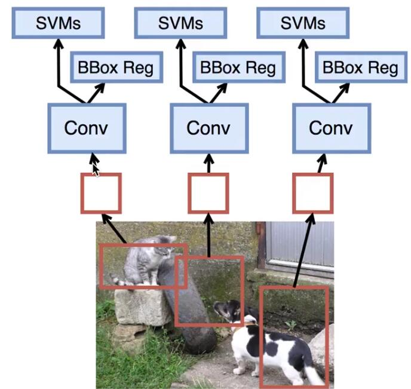
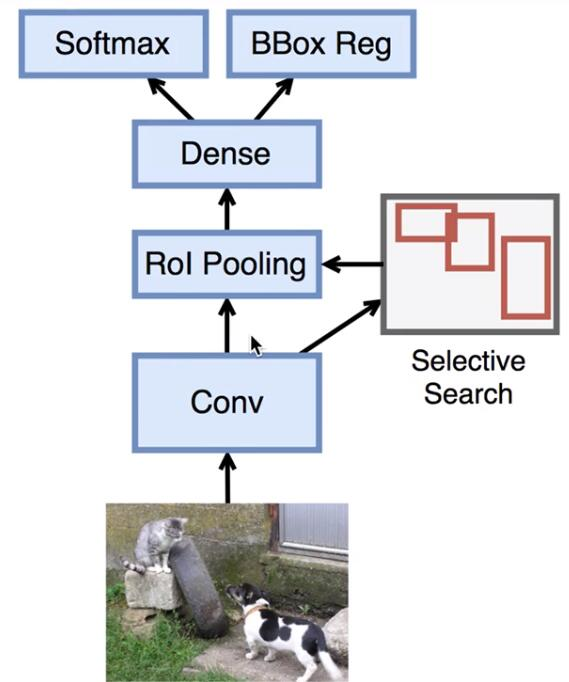
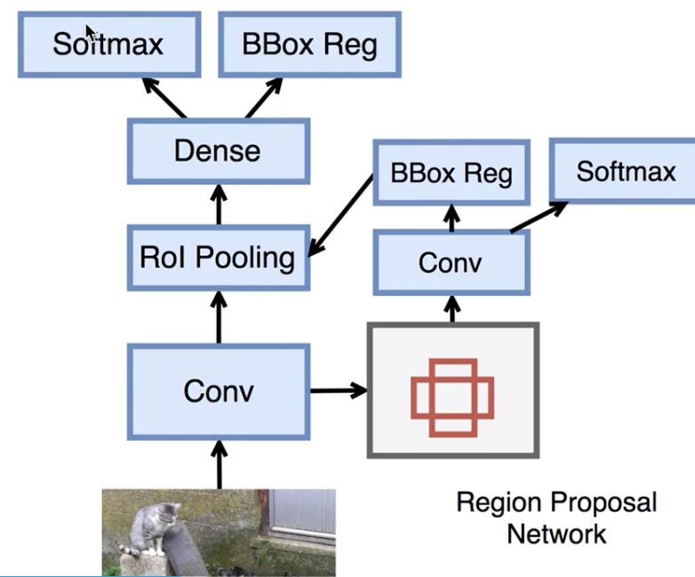
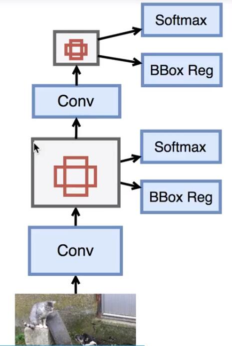
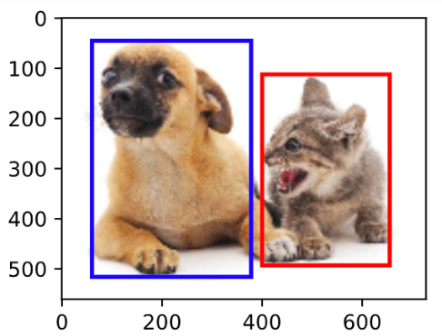
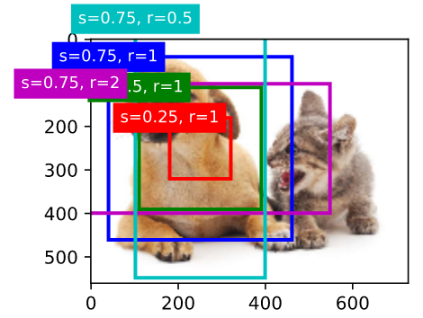
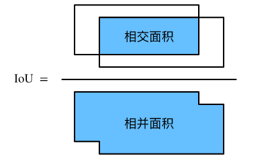
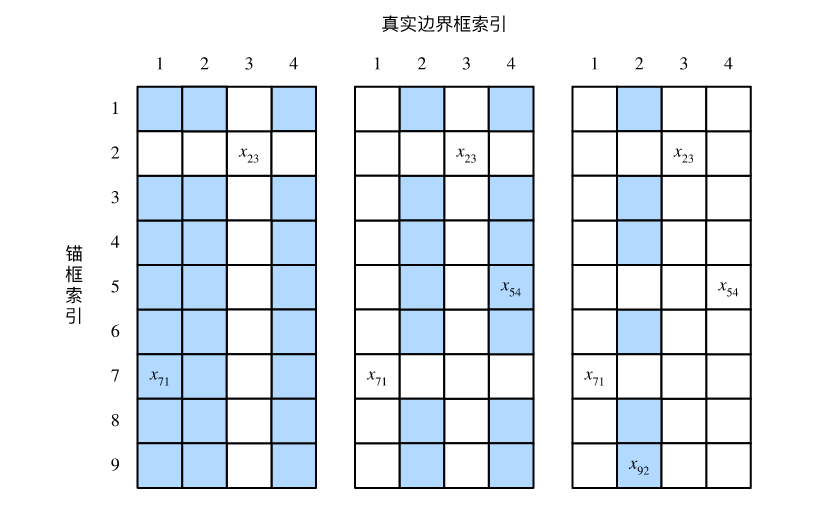
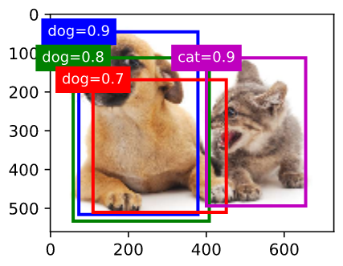

## R-CNN
[R-CNN](http://fcv2011.ulsan.ac.kr/files/announcement/513/r-cnn-cvpr.pdf)，这是给予卷积神经网络的物体检测的奠基之作。其核心思想是在对每张图片选取多个区域，然后每个区域作为一个样本进入一个卷积神经网络来提取特征，最后使用分类器来对齐分类，和一个回归器来得到准确的边框。
**选择特征搜索边框**

每张图选取2000个区域，分别做卷积，使用SVM单分类器做判别，对其位置做回归。

具体来说，R-CNN主要由以下4步构成。

1. 对输入图像使用选择性搜索（selective search）来选取多个高质量的提议区域 [2]。这些提议区域通常是在多个尺度下选取的，并具有不同的形状和大小。每个提议区域将被标注类别和真实边界框。
2. 选取一个预训练的卷积神经网络，并将其在输出层之前截断。将每个提议区域变形为网络需要的输入尺寸，并通过前向计算输出抽取的提议区域特征。
3. 将每个提议区域的特征连同其标注的类别作为一个样本，训练多个支持向量机对目标分类。其中每个支持向量机用来判断样本是否属于某一个类别。
4. 将每个提议区域的特征连同其标注的边界框作为一个样本，训练线性回归模型来预测真实边界框。

## Fast R-CNN
- 1.考虑到R-CNN里面的大量区域可能是相互覆盖的，每次重新抽取特征过于浪费。因此Fast R-CNN先对输入图片抽取特征，然后再选取区域。
- 2.Fast R-CNN使用多个多类逻辑回归，代替R-CNN使用多个SVM来做分类。

**选择特征搜索边框**


它的主要计算步骤如下。

1. 与R-CNN相比，Fast R-CNN用来提取特征的卷积神经网络的输入是整个图像，而不是各个提议区域。而且，这个网络通常会参与训练，即更新模型参数。设输入为一张图像，将卷积神经网络的输出的形状记为$1 \times c \times h_1 \times w_1$。
1. 假设选择性搜索生成$n$个提议区域。这些形状各异的提议区域在卷积神经网络的输出上分别标出形状各异的兴趣区域。这些兴趣区域需要抽取出形状相同的特征（假设高和宽均分别指定为$h_2$和$w_2$）以便于连结后输出。Fast R-CNN引入兴趣区域池化（region of interest pooling，RoI池化）层，将卷积神经网络的输出和提议区域作为输入，输出连结后的各个提议区域抽取的特征，形状为$n \times c \times h_2 \times w_2$。
1. 通过全连接层将输出形状变换为$n \times d$，其中超参数$d$取决于模型设计。
1. 预测类别时，将全连接层的输出的形状再变换为$n \times q$并使用softmax回归（$q$为类别个数）。预测边界框时，将全连接层的输出的形状变换为$n \times 4$。也就是说，我们为每个提议区域预测类别和边界框。

## Faster R-CNN
将锚框的选择性搜索变成了区域提议网络，RPN预测锚框中的类别，如果未超过阈值，则不将所对应的BBox加入到RoI Pooling中。

**选择特征搜索边框**


与Fast R-CNN相比，只有生成提议区域的方法从选择性搜索变成了区域提议网络，而其他部分均保持不变。具体来说，区域提议网络的计算步骤如下。

1. 使用填充为1的$3\times 3$卷积层变换卷积神经网络的输出，并将输出通道数记为$c$。这样，卷积神经网络为图像抽取的特征图中的每个单元均得到一个长度为$c$的新特征。
1. 以特征图每个单元为中心，生成多个不同大小和宽高比的锚框并标注它们。
1. 用锚框中心单元长度为$c$的特征分别预测该锚框的二元类别（含目标还是背景）和边界框。
1. 使用非极大值抑制，从预测类别为目标的预测边界框中移除相似的结果。最终输出的预测边界框即兴趣区域池化层所需要的提议区域。

# 单发多框检测（single shot multibox detection，SSD）
去掉RoI Pooling，通过卷积生成多尺度的特征图，再进行多次RPN。


### 1.边界框(bounding box)
bbox是bounding box的缩写，在目标检测任务中，通常使用边界框来描述目标位置。边界框是一个矩形框，可以由矩形左上角的(x,y)与右下角的(x,y)坐标来确定。

``` python
dog_bbox, cat_bbox = [60, 45, 378, 516], [400, 112, 655, 493]
```


### 2.锚框(anchor box)
目标检测算法通常会在输入图像中采样大量的区域,然后判断这些区域中是否包含我们感兴趣的目标,并调整区域边缘从而更准确地预测目标的真实边界框(ground-truth bounding box)。不不同的模型使用的区域采样方法可能不同。这里我们介绍其中的一种方法:它以每个像素为中心生成多个大小和宽高比(aspect ratio)不同的边界框。这些边界框被称为锚框(anchor box)。

- **生成多个锚框**

假设输入图像高为$h$，宽为$w$。我们分别以图像的每个像素为中心生成不同形状的锚框。设大小为$size\in (0,1]$且宽高比为$ratio > 0$，那么锚框的宽和高将分别为$ws\sqrt{r}$和$hs/\sqrt{r}$。当中心位置给定时，已知宽和高的锚框是确定的。

下面我们分别设定好一组大小$s_1,\ldots,s_n$和一组宽高比$r_1,\ldots,r_m$。如果以每个像素为中心时使用所有的大小与宽高比的组合，输入图像将一共得到$whnm$个锚框。虽然这些锚框可能覆盖了所有的真实边界框，但计算复杂度容易过高。因此，我们通常只对包含$s_1$或$r_1$的大小与宽高比的组合感兴趣，即

$$(s_1, r_1), (s_1, r_2), \ldots, (s_1, r_m)$$$$(s_2, r_1), (s_3, r_1), \ldots, (s_n, r_1).$$

也就是说，以相同像素为中心的锚框的数量为$n+m-1$(减去的是$s_1,r_1$情况)。对于整个输入图像，我们将一共生成$wh(n+m-1)$个锚框。



### 3.交并比
给定集合$\mathcal{A}$和$\mathcal{B}$，它们的Jaccard系数即二者交集大小除以二者并集大小：

$$J(\mathcal{A},\mathcal{B}) = \frac{\left|\mathcal{A} \cap \mathcal{B}\right|}{\left| \mathcal{A} \cup \mathcal{B}\right|}.$$

当衡量两个边界框的相似度时，我们通常将Jaccard系数称为交并比（intersection over union，IoU），即两个边界框相交面积与相并面积之比，如下图所示。交并比的取值范围在0和1之间：0表示两个边界框无重合像素，1表示两个边界框相等。



### 4.标注训练集的锚框


在训练集中，我们将每个锚框视为一个训练样本。为了训练目标检测模型，我们需要为每个锚框标注两类标签：一是锚框所含目标的类别，简称类别；二是真实边界框相对锚框的偏移量，简称偏移量（offset）。在目标检测时，我们首先生成多个锚框，然后为每个锚框预测类别以及偏移量，接着根据预测的偏移量调整锚框位置从而得到预测边界框，最后筛选需要输出的预测边界框。


我们知道，在目标检测的训练集中，每个图像已标注了真实边界框的位置以及所含目标的类别。在生成锚框之后，我们主要依据与锚框相似的真实边界框的位置和类别信息为锚框标注。那么，该如何为锚框分配与其相似的真实边界框呢？


假设图像中锚框分别为$A_1, A_2, \ldots, A_{n_a}$，真实边界框分别为$B_1, B_2, \ldots, B_{n_b}$，且$n_a \geq n_b$。定义矩阵$\boldsymbol{X} \in \mathbb{R}^{n_a \times n_b}$，其中第$i$行第$j$列的元素$x_{ij}$为锚框$A_i$与真实边界框$B_j$的交并比。
首先，我们找出矩阵$\boldsymbol{X}$中最大元素，并将该元素的行索引与列索引分别记为$i_1,j_1$。我们为锚框$A_{i_1}$分配真实边界框$B_{j_1}$。显然，锚框$A_{i_1}$和真实边界框$B_{j_1}$在所有的“锚框—真实边界框”的配对中相似度最高。

接下来，将矩阵$\boldsymbol{X}$中第$i_1$行和第$j_1$列上的所有元素丢弃。找出矩阵$\boldsymbol{X}$中剩余的最大元素，并将该元素的行索引与列索引分别记为$i_2,j_2$。我们为锚框$A_{i_2}$分配真实边界框$B_{j_2}$，再将矩阵$\boldsymbol{X}$中第$i_2$行和第$j_2$列上的所有元素丢弃。此时矩阵$\boldsymbol{X}$中已有两行两列的元素被丢弃。

依此类推，直到矩阵$\boldsymbol{X}$中所有$n_b$列元素全部被丢弃。这个时候，我们已为$n_b$个锚框各分配了一个真实边界框。
接下来，我们只遍历剩余的$n_a - n_b$个锚框：给定其中的锚框$A_i$，根据矩阵$\boldsymbol{X}$的第$i$行找到与$A_i$交并比最大的真实边界框$B_j$，且只有当该交并比大于预先设定的阈值时，才为锚框$A_i$分配真实边界框$B_j$。


如图（左）所示，假设矩阵$\boldsymbol{X}$中最大值为$x_{23}$，我们将为锚框$A_2$分配真实边界框$B_3$。然后，丢弃矩阵中第2行和第3列的所有元素，找出剩余阴影部分的最大元素$x_{71}$，为锚框$A_7$分配真实边界框$B_1$。接着如图（中）所示，丢弃矩阵中第7行和第1列的所有元素，找出剩余阴影部分的最大元素$x_{54}$，为锚框$A_5$分配真实边界框$B_4$。最后如图（右）所示，丢弃矩阵中第5行和第4列的所有元素，找出剩余阴影部分的最大元素$x_{92}$，为锚框$A_9$分配真实边界框$B_2$。之后，我们只需遍历除去$A_2, A_5, A_7, A_9$的剩余锚框，并根据阈值判断是否为剩余锚框分配真实边界框。



现在我们可以标注锚框的类别和偏移量了。如果一个锚框$A$被分配了真实边界框$B$，将锚框$A$的类别设为$B$的类别，并根据$B$和$A$的中心坐标的相对位置以及两个框的相对大小为锚框$A$标注偏移量。由于数据集中各个框的位置和大小各异，因此这些相对位置和相对大小通常需要一些特殊变换，才能使偏移量的分布更均匀从而更容易拟合。设锚框$A$及其被分配的真实边界框$B$的中心坐标分别为$(x_a, y_a)$和$(x_b, y_b)$，$A$和$B$的宽分别为$w_a$和$w_b$，高分别为$h_a$和$h_b$，一个常用的技巧是将$A$的偏移量标注为

$$\left( \frac{ \frac{x_b - x_a}{w_a} - \mu_x }{\sigma_x},
\frac{ \frac{y_b - y_a}{h_a} - \mu_y }{\sigma_y},
\frac{ \log \frac{w_b}{w_a} - \mu_w }{\sigma_w},
\frac{ \log \frac{h_b}{h_a} - \mu_h }{\sigma_h}\right),$$

其中常数的默认值为$\mu_x = \mu_y = \mu_w = \mu_h = 0, \sigma_x=\sigma_y=0.1, \sigma_w=\sigma_h=0.2$。**如果一个锚框没有被分配真实边界框，我们只需将该锚框的类别设为背景**。类别为背景的锚框通常被称为负类锚框，其余则被称为正类锚框。

- 掩码mask

我们可以通过`contrib.nd`模块中的`MultiBoxTarget`函数来为锚框标注类别和偏移量。该函数将背景类别设为0，并令从零开始的目标类别的整数索引自加1（1为狗，2为猫）。我们通过`expand_dims`函数为锚框和真实边界框添加样本维，并构造形状为(批量大小, 包括背景的类别个数, 锚框数)的任意预测结果。

``` python
labels = contrib.nd.MultiBoxTarget(anchors.expand_dims(axis=0),
                                   ground_truth.expand_dims(axis=0),
                                   nd.zeros((1, 3, 5)))
```
返回的结果里有3项，均为`NDArray`。第三项表示为锚框标注的类别。
```python
>>> labels[2]
[[0. 1. 2. 0. 2.]]
```
返回值的第二项为掩码（mask）变量，形状为(批量大小, 锚框个数的四倍)。掩码变量中的元素与每个锚框的4个偏移量一一对应。
由于我们不关心对背景的检测，有关负类的偏移量不应影响目标函数。通过按元素乘法，掩码变量中的0可以在计算目标函数之前过滤掉负类的偏移量。
```python
>>> labels[1]
[[0. 0. 0. 0. 1. 1. 1. 1. 1. 1. 1. 1. 0. 0. 0. 0. 1. 1. 1. 1.]]
```
返回的第一项是为每个锚框标注的四个偏移量，其中负类锚框的偏移量标注为0。

```python
>>> labels[0]
[[ 0.00e+00  0.00e+00  0.00e+00  0.00e+00  1.40e+00  1.00e+01  2.59e+00
   7.18e+00 -1.20e+00  2.69e-01  1.68e+00 -1.57e+00  0.00e+00  0.00e+00
   0.00e+00  0.00e+00 -5.71e-01 -1.00e+00 -8.94e-07  6.26e-01]]
```

### 5.输出预测边界框

在模型预测阶段，我们先为图像生成多个锚框，并为这些锚框一一预测类别和偏移量。随后，我们根据锚框及其预测偏移量得到预测边界框。当锚框数量较多时，同一个目标上可能会输出较多相似的预测边界框。为了使结果更加简洁，我们可以移除相似的预测边界框。常用的方法叫作非极大值抑制（non-maximum suppression，NMS）。

我们来描述一下非极大值抑制的工作原理。对于一个预测边界框$B$，模型会计算各个类别的预测概率。设其中最大的预测概率为$p$，该概率所对应的类别即$B$的预测类别。我们也将$p$称为预测边界框$B$的置信度。在同一图像上，我们将预测类别非背景的预测边界框按置信度从高到低排序，得到列表$L$。从$L$中选取置信度最高的预测边界框$B_1$作为基准，将所有与$B_1$的交并比大于某阈值的非基准预测边界框从$L$中移除。这里的阈值是预先设定的超参数。此时，$L$保留了置信度最高的预测边界框并移除了与其相似的其他预测边界框。
接下来，从$L$中选取置信度第二高的预测边界框$B_2$作为基准，将所有与$B_2$的交并比大于某阈值的非基准预测边界框从$L$中移除。重复这一过程，直到$L$中所有的预测边界框都曾作为基准。此时$L$中任意一对预测边界框的交并比都小于阈值。最终，输出列表$L$中的所有预测边界框。

下面来看一个具体的例子。先构造4个锚框。简单起见，我们假设预测偏移量全是0：预测边界框即锚框。最后，我们构造每个类别的预测概率。
``` python
anchors = nd.array([[0.1, 0.08, 0.52, 0.92], [0.08, 0.2, 0.56, 0.95],
                    [0.15, 0.3, 0.62, 0.91], [0.55, 0.2, 0.9, 0.88]])
offset_preds = nd.array([0] * anchors.size)
cls_probs = nd.array([[0] * 4,  # 背景的预测概率
                      [0.9, 0.8, 0.7, 0.1],  # 狗的预测概率
                      [0.1, 0.2, 0.3, 0.9]])  # 猫的预测概率
```


我们使用`contrib.nd`模块的`MultiBoxDetection`函数来执行非极大值抑制并设阈值为0.5。这里为`NDArray`输入都增加了样本维。我们看到，返回的结果的形状为(批量大小, 锚框个数, 6)。其中每一行的6个元素代表同一个预测边界框的输出信息。第一个元素是索引从0开始计数的预测类别（0为狗，1为猫），其中-1表示背景或在非极大值抑制中被移除。第二个元素是预测边界框的置信度。剩余的4个元素分别是预测边界框左上角的$x$和$y$轴坐标以及右下角的$x$和$y$轴坐标（值域在0到1之间）。
``` python
output = contrib.ndarray.MultiBoxDetection(
    cls_probs.expand_dims(axis=0), offset_preds.expand_dims(axis=0),
    anchors.expand_dims(axis=0), nms_threshold=0.5)
output
```
```
[[[ 0.    0.9   0.1   0.08  0.52  0.92]
  [ 1.    0.9   0.55  0.2   0.9   0.88]
  [-1.    0.8   0.08  0.2   0.56  0.95]
  [-1.    0.7   0.15  0.3   0.62  0.91]]]
<NDArray 1x4x6 @cpu(0)>
```
我们移除掉类别为-1的预测边界框，并可视化非极大值抑制保留的结果。


实践中，我们可以在执行非极大值抑制前将置信度较低的预测边界框移除，从而减小非极大值抑制的计算量。我们还可以筛选非极大值抑制的输出，例如，只保留其中置信度较高的结果作为最终输出。